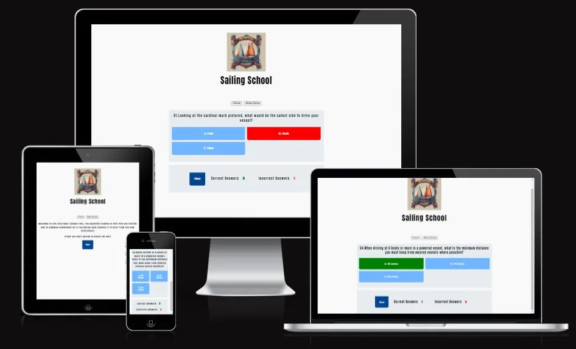
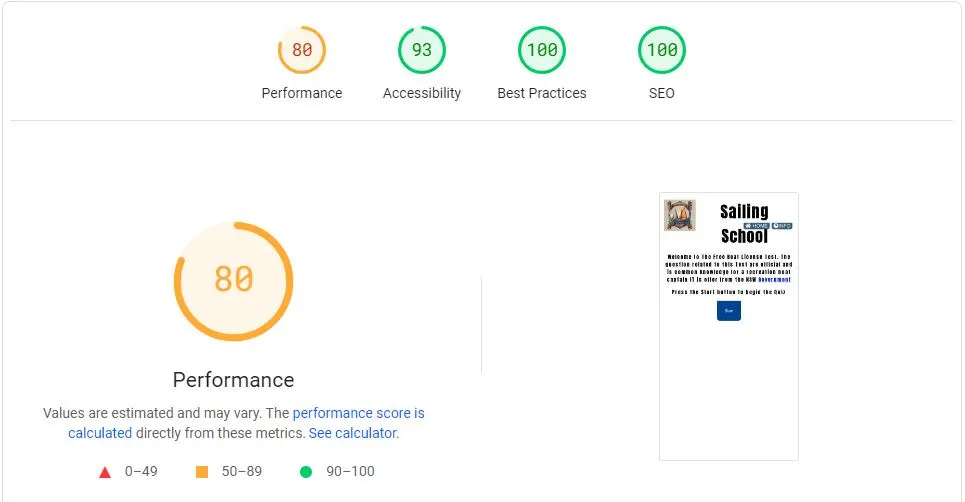

<div align="center">
  
</div>
<div align="center">
  
</div>

 Ahoy there!, Sailing School,Is happy to introduce the Trivia Game for boat License for Recreation Purpose If you've ever dreamt of navigating the open seas, feeling the wind in your sails, and harnessing the power of the ocean, you're in the right place. Sailing School is your go-to resource for mastering the basics of sailing. In This README you will find all the process that we use to build our Tool to help you master the information to pass in the Test. I am a sailor since 1999  and i have struggle to get all the information today it is possible to have in the tip of your fingers.My Idea is to bring information to people that are interest in sailing.

 [Link for our Quizz](https://rdidjurgeit.github.io/project2_r.didjurgeit/)

## Table of Contents

- [UX](#ux)
    - [Concept](#concept)
  - [Goals](#goals)
    - [Visitor Goals](#visitor-goals)
    - [User goals are](#user-goals-are)
  - [Visual Design](#visual-design)
    - [Fonts](#fonts)
    - [Icons](#icons)
    - [Colors](#colors)
    - [Images](#images)
- [Features](#features)
  - [Page Elements](#page-elements)
    - [Index Page](#index-page)
  - [Future Ideas](#future-ideas)
    - [Content](#content)
- [Technologies Used](#technologies-used)
  - [Languages](#languages)
  - [Libraries](#libraries)
  - [Platforms](#platforms)
  - [Other Tools](#other-tools)
- [Testing](#testing)
  - [Methods](#methods)
    - [Validation](#validation)
  - [General Testing](#general-testing)
    - [Mobile Testing](#mobile-testing)
    - [Desktop Testing](#desktop-testing)
  - [Bugs](#bugs)
    - [Known Bugs](#known-bugs)
- [Deployment](#deployment)
  - [Local Deployment](#local-deployment)
    - [Local Preparation](#local-preparation)
  - [Credits and Contact](#credits-and-contact)
    - [Content](#content-1)
    - [Contact](#contact)

----

# UX

### Concept

Embark on a thrilling journey of maritime knowledge with "Boater's Quest Quiz" – an engaging and educational quiz game designed to test and enhance your understanding of the License for Recreation Boating. Get ready to set sail on a virtual adventure filled with questions, challenges, and captivating visuals that bring the world of boating to life.

The concent is a quiz game to test knowledge about the License for Recreation Boating. The idea is to have later on pictures that will be later implemented. During develop the idea to have a Submit button was later change to only have a nex when question is selected

- Wiframe Mobile,

<div align="center">
  
</div>

----
- Wiframe Desktop,

<div align="center">
  
</div>

----

## Goals

The goal of this project is to create an interactive and engaging front-end web application designed to educate and test users' knowledge about boating safety and regulations. This application provides:

- A user-friendly interface that ensures accessibility and responsiveness across devices.
- Interactive elements, such as quizzes, feedback, and hints, to make learning more effective and enjoyable.
- A focus on improving users’ understanding of critical boating guidelines through a structured and intuitive quiz format.
- Seamless navigation and an aesthetically pleasing design to enhance the overall user experience.

By achieving these goals, the project aims to promote awareness of boating safety in an accessible and engaging way for all users.

### Visitor Goals

The target audience :

- People who want to Lear how to Sail.
- People who are interested in advance your one knowledge .
- People that want to buy a Boat.
- People that want to know about safety.
- People that want to test you knowledge.

### User goals are

- Get an overview of the test knowledge of Boat License.
- Practice to the test, get information about the test.

The School fills these needs by:

- Opening with a basic overview and explanation about the rules and giving links to know more about.
- Question are Randomize and not Repeating them self during the game.
- you need at the moment 5 correct response to pass but in the future will integrate the correct quantity os question question need it to pass in the test as the wrong question .
- Prepare for Boating Certification: Whether you're a seasoned boater or a newcomer seeking certification, "Boater's Quest Quiz" serves as an excellent study tool. Brush up on the latest regulations and guidelines, ensuring you are well-prepared for any boating examination.

## Visual Design

The visual design of this project focuses on creating a clean, intuitive, and visually appealing interface that enhances user engagement. Key elements of the visual design include:

- Consistent Color Palette: A harmonious selection of colors to evoke a sense of calm and professionalism, with highlights to guide user attention.
- Responsive Layout: Designed to adapt seamlessly to various screen sizes, ensuring accessibility and usability across all devices.
- Clear Typography: Readable and well-structured text that maintains hierarchy and clarity for ease of navigation and comprehension.
- Interactive Elements: Visually distinct buttons, feedback areas, and hints to encourage user interaction and provide real-time engagement.
- Minimalist Approach: A focus on simplicity to avoid unnecessary distractions, ensuring the content remains the central focus.

This design ensures a balance between aesthetics and functionality, creating an engaging and enjoyable user experience.

### Fonts

- The primary font, [Anton](https://fonts.google.com/selection?query=Anton) was chosen because IT is a font friendly for dyslexia , making it very easily readable throughout the questions.

### Icons

- Icons are taken from the [Fontawesome](https://fontawesome.com/) Icon library and are utilised as classes in the `<i>` tag.
- As they are utilized as classes, they can easily be styled using other classes or IDs in the same tag. I often used Bootstrap classes to style them uniformly.

### Colors

- I wanted the site to maintain a minimal aesthetic, colors are very basic and clean . Using diferent tones of Blue.
- A clean and intuitive interface, allowing you to navigate seamlessly through questions and challenges. The absence of unnecessary elements ensures a distraction-free learning environment.

### Images

- The site has some images for better visualization of the question (to implement).

----

# Features

This application offers a variety of interactive features designed to provide an engaging and educational experience for users:

- Interactive Quiz: A dynamically generated quiz with randomized questions to test boating knowledge.
- Hint System: A "Get Hint" button to guide users toward the correct answer without revealing it outright.
- Feedback Mechanism: Immediate feedback for correct and incorrect answers, helping users learn as they go.
- Timer: A countdown timer adds a sense of urgency and challenges users to answer promptly.
- Score Tracking: Displays the number of correct and incorrect answers in real-time, keeping users informed about their performance.
- Review Section: A review page for incorrect answers, allowing users to revisit and learn from their mistakes.
- Restart Option: The ability to restart the quiz anytime to reinforce learning or improve scores.
- Responsive Design: Ensures the application is accessible and functional across all devices, from desktops to mobile phones.

## Page Elements

The application is structured into several core elements to enhance usability and functionality:

- Header:Contains the application title, logo, and navigation links for easy access to other resources.
- Main Content:Welcome Section, Quiz Section with Hint Button.
- Feedback Section: Give feedback of score
- Review Section: Shows ate the end the wrong Questions.

### Index Page

- Delivery information from The rules.The design philosophy revolves around keeping the learning experience focused and immersive. No flashy elements, just you and the knowledge of boating against a backdrop of serene blues. The Correct response will be in Green and Next Button wil show up.

## Future Ideas

- Is to implement in a website maybe in the project 1 with more video and interactive images.

### Content

- As we sail through the boundless opportunities of the internet, the thought emerges like a guiding star on the horizon. Considering to make an Instagram presence and have a better foot in the social media. Later on maybe animation to help visualize.

----

# Technologies Used

- Because is a Small project with small javaScrips there was no need off more advance tool our an API. It was limited at one HTML, Style and JS files.

## Languages

- [HTML](https://html.spec.whatwg.org/)
  - Page markup.
- [CSS](https://www.w3.org/Style/CSS/specs.en.html)
  - Styling.
- [Javascript](https://standardjs.com/)
  - Running function for interactive.

## Libraries

-For be able to be a UserFriendly i limit my self for a Font Style and not many visual pollution.

    * Font Styles.

- [Fontawesome](https://fontawesome.com/)
  - Used for icons

## Platforms

- [Github](https://github.com/)
  - Storing code remotely and deployment.
- [Gitpod](https://gitpod.io/)
  - IDE for project development.

## Other Tools

- [Visual Studio Code](https://code.visualstudio.com/)
  - To create.
  - Extension: Code Spell Checker;Prettier; Live Server,ESlint,Node.js,PowerShell
- [Favicon from icons8](https://icons8.com/)
  - Favicons

----

# Testing

  The application underwent rigorous testing to ensure high-quality performance, accessibility, and compliance with web standards. Key tools and methodologies used for testing include:

- HTML Validation: It was use the W3C HTML Validator to ensure the markup adheres to web standards.
- CSS Validation: The W3C CSS Validator was use for the CSS to confirm proper syntax
- For performance and Responsive Dimensions was use the devTool from Google Chrome and Lighthouse.

---

## Methods

For Validation process you will need to go in each link from W3C and put you code our you page so it can start the process. if there is no mistakes it will have a confirmation image: Common Error you can find is regarding using section and not using header.

<div align="center">
  
</div>

### Validation

- HTML has been validated with [W3C HTML5 Validator](https://validator.w3.org/).
  - Only Warning since section have no heading but for this case it is not necessary.
- CSS has been validated with [W3C CSS Validator](https://jigsaw.w3.org/css-validator/)
- Links checked with [W3C Link Checker](https://validator.w3.org/checklink).
- Each javascript file was tested on the site for errors and functionality using the console.

## General Testing

- General Testing in this case is use different browser like Firefox and Google Chrome as Opera for Apple. 

### Mobile Testing

<div align="center">
  
</div>

- I tested the site personally in my mobile, going through all the pages.
- Chrome was utilized to inspect the site in mobile format, going through the pages and functions.

----

### Desktop Testing

<div align="center">
  
</div>

- The site was marginally tested on other browsers, such as Firefox.

## Bugs

### Known Bugs

- The initial Bugs was that you need it after change question to click 2 times so the click will compute. That was fix and it was a problem of logic during the process to generate a new question.

----

# Deployment

The application has been successfully deployed to a cloud-based hosting platform, ensuring that it is accessible to users globally. Below are the details of the deployment process:

## Local Deployment

For Local Deployment you can navigate in the repository until you find a green botton on the right side:

```
<>Code
```

There you have the option to Download in Zip our Clone using the respective [URL](https://github.com/rdidjurgeit/project2_rdidjurgeit.git)

### Local Preparation

- For the preparation you will need a source code editor, in my case I use VSCode since is a free tool from Microsoft. with a big library off extension.

**Requirements:**

- An IDE of your choice, such as [Visual Studio Code](https://code.visualstudio.com/)
- This IDE will need a [Git](https://git-scm.com/)
- You will have to set up a connection with an email
- Live Server Extencion so you can see the Code every time you safe our interact.

## Credits and Contact

### Content

The question where taken from  [NSW GOV](https://www.nsw.gov.au/sites/default/files/2021-10/general-boat-driving-licence-knowledge-test-questions.pdf).
This version off quiz game is base on a similar from the creator [WebDev Simplified](https://www.youtube.com/@WebDevSimplified) He have a nice way to show the process of creating the quiz some steps where follow and same terminology use. During my research i found similar Quiz game with same terminology and ideas. I decide to follow the [video](https://www.youtube.com/watch?v=riDzcEQbX6k&t=237s&ab_channel=WebDevSimplified) from this Content Creator because he explain in a good way the process.
Readme example provide by my mentor Patrick Rory.

### Contact

Please feel free to contact me at `didjurgeit.raphael@gmail.com`
