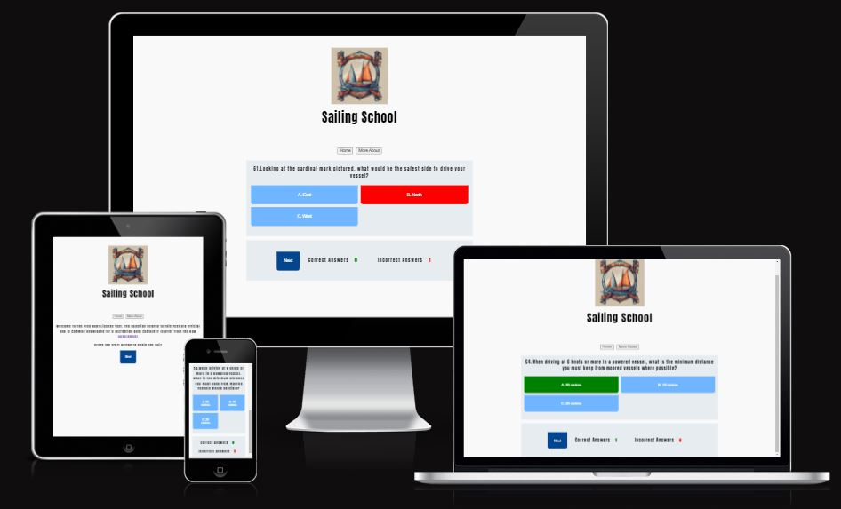
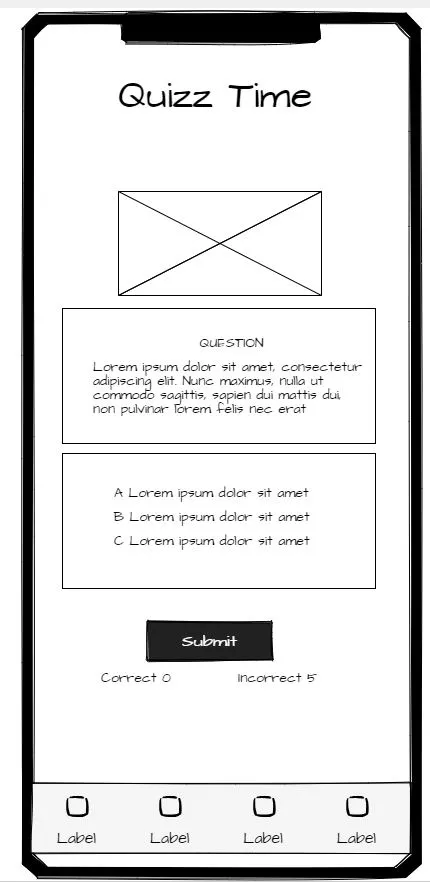
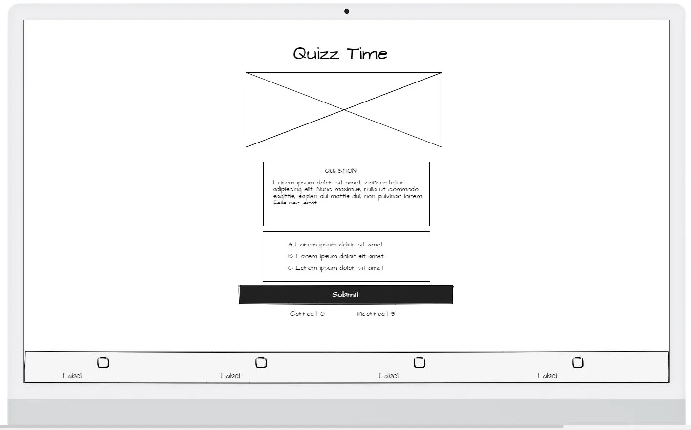
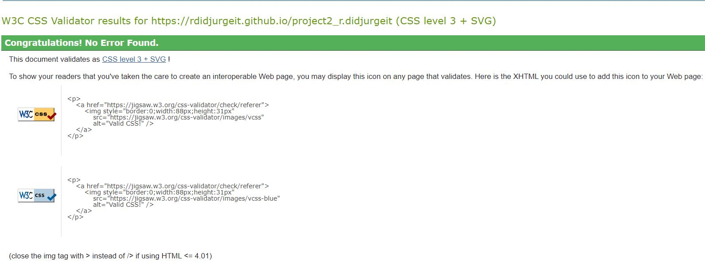
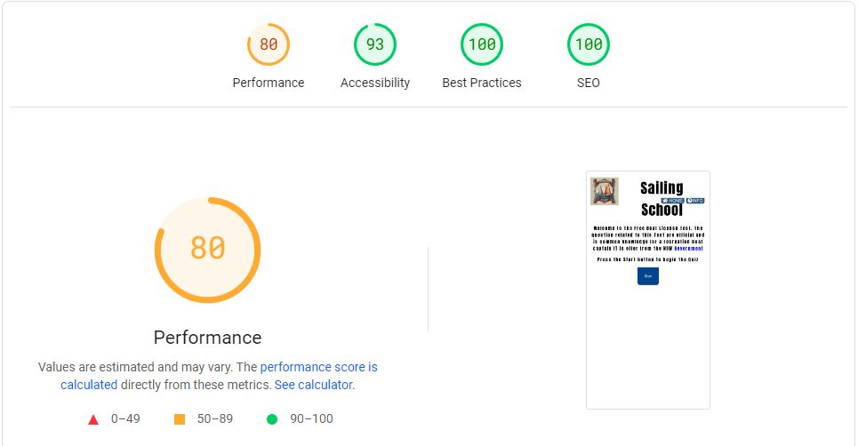
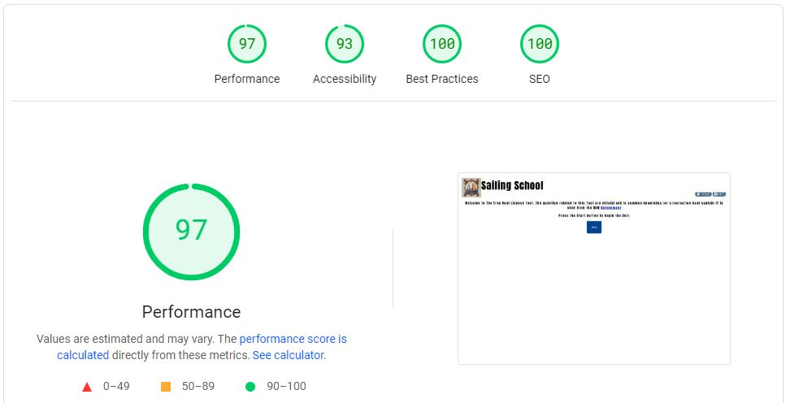

  

  

 Ahoy there!, Sailing School,Is happy to introduce the Trivia Game for boat License for Recreation Purpose If you've ever dreamt of navigating the open seas, feeling the wind in your sails, and harnessing the power of the ocean, you're in the right place. Sailing School is your go-to resource for mastering the basics of sailing. In This README you will find all the process that we use to build our Tool to help you master the information to pass in the Test. I am a sailor since 1999  and i have struggle to get all the information today it is possible to have in the tip of your fingers.My Idea is to bring information to people that are interest in sailing.

 [Link for our Quizz](https://rdidjurgeit.github.io/project2_r.didjurgeit/)
## Table of Contents
1. 

    
<a href="#ux">UX</a>

    <ul>
    <li>

    
<a href="#Concept">Concept</a>

    
</li>

    <li>

    
<a href="#goals">Goals</a>

    - [Visitor Goals](#visitor-goals)
    - [Business Goals](#business-goals)
    - [User Stories](#user-stories)
    
</li>

    <li>

    
<a href="#visual-design">Visual Design</a>

    - [Fonts](#fonts)
    - [Icons](#icons)
    - [Colors](#colors)
    - [Images](#images)
    
</li>
    </ul>

2. 

    
<a href="#features">Features</a>

3. 

    
<a href="#technologies-used">Technologies Used</a>

    - [Languages](#languages)
    - [Libraries](#libraries)
    - [Platforms](#platforms)
    - [Other Tools](#other-tools)

4. 

    
<a href="#testing">Testing</a>

    <ul>
    <li>

    
<a href="#methods">Methods</a>

    - [Validation](#validation)
    - [General Testing](#general-testing)
    - [Mobile Testing](#mobile-testing)
    - [Desktop Testing](#desktop-testing)
    
</li>

    <li>

    
<a href="#bugs">Bugs</a>

    - [Known Bugs](#known-bugs)
    
</li>
    </ul>

5. 

    
<a href="#deployment">Deployment</a>

    <ul>
    <li>

    
<a href="#local-deployment">Local Deployment</a>

    - [Local Preparation](#local-preparation)
    
</li>

    <li>

    
<a href="#github-deployment">Github Deployment</a>

    - [Github Preparation](#github-preparation)
    
</li>
    </ul>

6. 

    
<a href="#credit-and-contact">Credit and Contact</a>

    - [Content](#content)
    - [Contact](#contact)

----

# UX

### Concept

Embark on a thrilling journey of maritime knowledge with "Boater's Quest Quiz" – an engaging and educational quiz game designed to test and enhance your understanding of the License for Recreation Boating. Get ready to set sail on a virtual adventure filled with questions, challenges, and captivating visuals that bring the world of boating to life.

The concent is a quiz game to test knowledge about the License for Recreation Boating. The idea is to have later on pictures that will be later implemented. During develop the idea to have a Submit button was later change to only have a nex when question is selected

- Wiframe Mobile,

  

- Wiframe Desktop,

  

## Goals

### Visitor Goals
The target audience :

- People who want to Lear how to Sail.
- People who are interested in advance your one knowledge .
- People that want to buy a Boat.
- People that want to know about safety.
- People that want to test you knowledge. 

### User goals are

- Get an overview of the test knowledge of Boat License.
- Practice to the test, get information about the test. 

The School fills these needs by:

- Opening with a basic overview and explanation about the rules and giving links to know more about.
- Question are Randomize and not Repeating them self during the game.
- you need at the moment 5 correct response to pass but in the future will integrate the correct quantity os question question need it to pass in the test as the wrong question .
- Prepare for Boating Certification: Whether you're a seasoned boater or a newcomer seeking certification, "Boater's Quest Quiz" serves as an excellent study tool. Brush up on the latest regulations and guidelines, ensuring you are well-prepared for any boating examination.

## Visual Design

### Fonts

- The primary font, [Anton](https://fonts.google.com/selection?query=Anton) was chosen because IT is a font friendly for dyslexia , making it very easily readable throughout the questions.

### Icons

- Icons are taken from the [Fontawesome](https://fontawesome.com/) Icon library and are utilised as classes in the `<i>` tag.
- As they are utilized as classes, they can easily be styled using other classes or IDs in the same tag. I often used Bootstrap classes to style them uniformly.

### Colors

- I wanted the site to maintain a minimal aesthetic, colors are very basic and clean . Using diferent tones of Blue.
- A clean and intuitive interface, allowing you to navigate seamlessly through questions and challenges. The absence of unnecessary elements ensures a distraction-free learning environment.

### Images

- The site has some images for better visualization of the question (to implement).

----

# Features

## Page Elements

### Index Page

- Delivery information from The rules.The design philosophy revolves around keeping the learning experience focused and immersive. No flashy elements, just you and the knowledge of boating against a backdrop of serene blues. The Correct response will be in Green and Next Button wil show up.

## Feature Ideas

### Content 

- As we sail through the boundless opportunities of the internet, the thought emerges like a guiding star on the horizon. Considering to make an Instagram presence and have a better foot in the social media. Later on maybe animation to help visualize.

----

# Technologies Used

## Languages

- [HTML](https://html.spec.whatwg.org/)
    * Page markup.
- [CSS](https://www.w3.org/Style/CSS/specs.en.html)
    * Styling.
-
- [Javascript](https://standardjs.com/)
    * Running function for interactive.

## Libraries

    * Font Styles.
- [Fontawesome](https://fontawesome.com/)
    * Used for icons

## Platforms
- [Github](https://github.com/)
    * Storing code remotely and deployment.
- [Gitpod](https://gitpod.io/)
    * IDE for project development.

## Other Tools
- [Visual Studio Code](https://code.visualstudio.com/)
    * To create. 
    * Extension: Code Spell Checker;Prettier; Live Server,ESlint,Node.js,PowerShell
- [Favicon from icons8](https://icons8.com/)
    * Favicons
----
# Testing

  

## Methods

### Validation
- HTML has been validated with [W3C HTML5 Validator](https://validator.w3.org/).
  * Only Warning since section have no heading but for this case it is not necessary.
- CSS has been validated with [W3C CSS Validator](https://jigsaw.w3.org/css-validator/) 
- Links checked with [W3C Link Checker](https://validator.w3.org/checklink).
- Each javascript file was tested on the site for errors and functionality using the console.

## General Testing

  

### Mobile Testing

- I tested the site personally in my mobile, going through all the pages.
- Chrome was utilized to inspect the site in mobile format, going through the pages and functions.

### Desktop Testing

  

- The site was marginally tested on other browsers, such as Firefox.

## Bugs

### Known Bugs

- The initial Bugs was that you need it after change question to click 2 times so the click will compute. That was fix and it was a problem of logic during the process to generate a new question.

----

# Deployment
## Local Deployment
### Local Preparation
**Requirements:**
- An IDE of your choice, such as [Visual Studio Code](https://code.visualstudio.com/)
- [Git](https://git-scm.com/)
- You will have to set up a connection with an email

## Credits and Contact
### Content
The question where taken from  [NSW GOV](https://www.nsw.gov.au/sites/default/files/2021-10/general-boat-driving-licence-knowledge-test-questions.pdf).
This version off quiz game is base on a similar from the creator [WebDev Simplified](https://www.youtube.com/@WebDevSimplified) He have a nice way to show the process of creating the quiz some steps where follow and same terminology use. During my research i found similar Quiz game with same terminology and ideas. I decide to follow the [video](https://www.youtube.com/watch?v=riDzcEQbX6k&t=237s&ab_channel=WebDevSimplified) from this Content Creator because he explain in a good way the process.
Readme example provide by my mentor Patrick Rory.

### Contact
Please feel free to contact me at `didjurgeit.raphael@gmail.com`